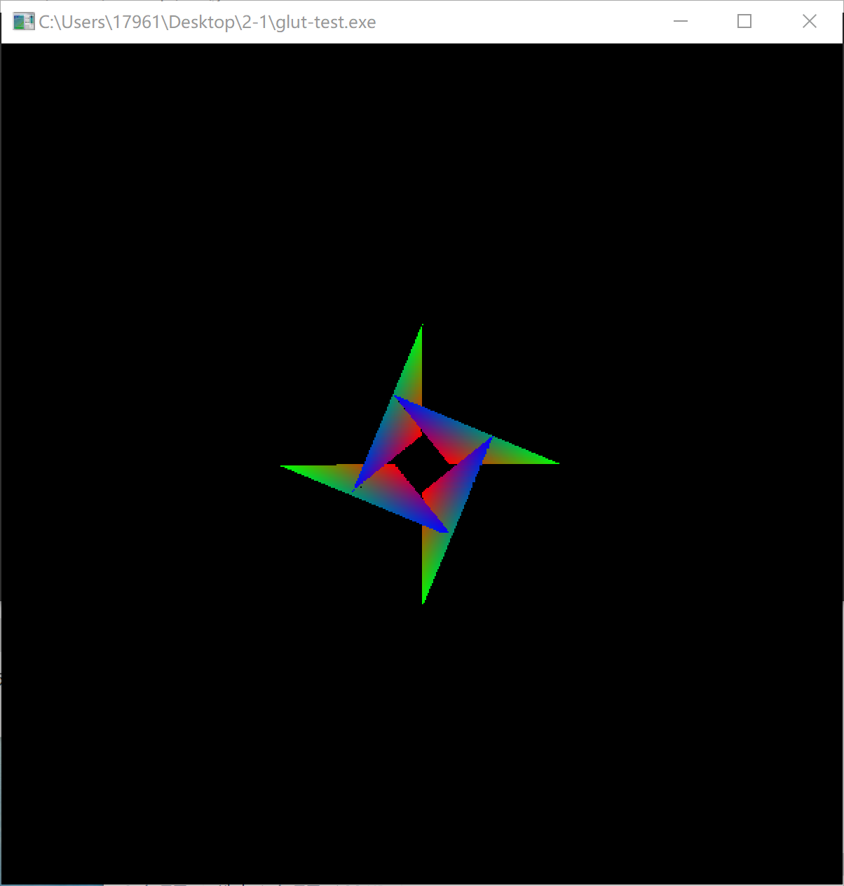
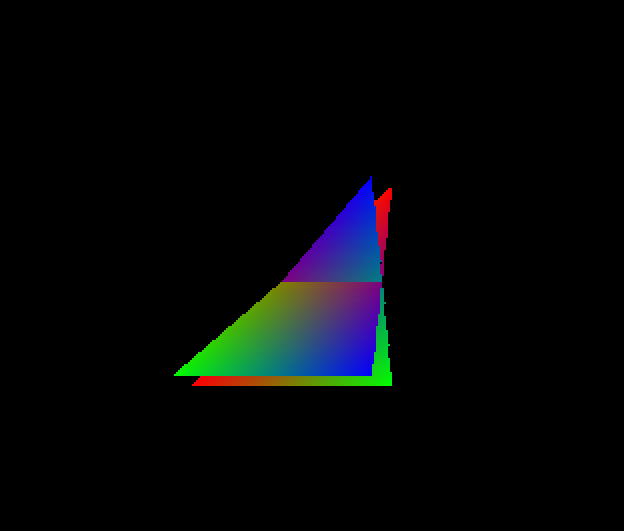
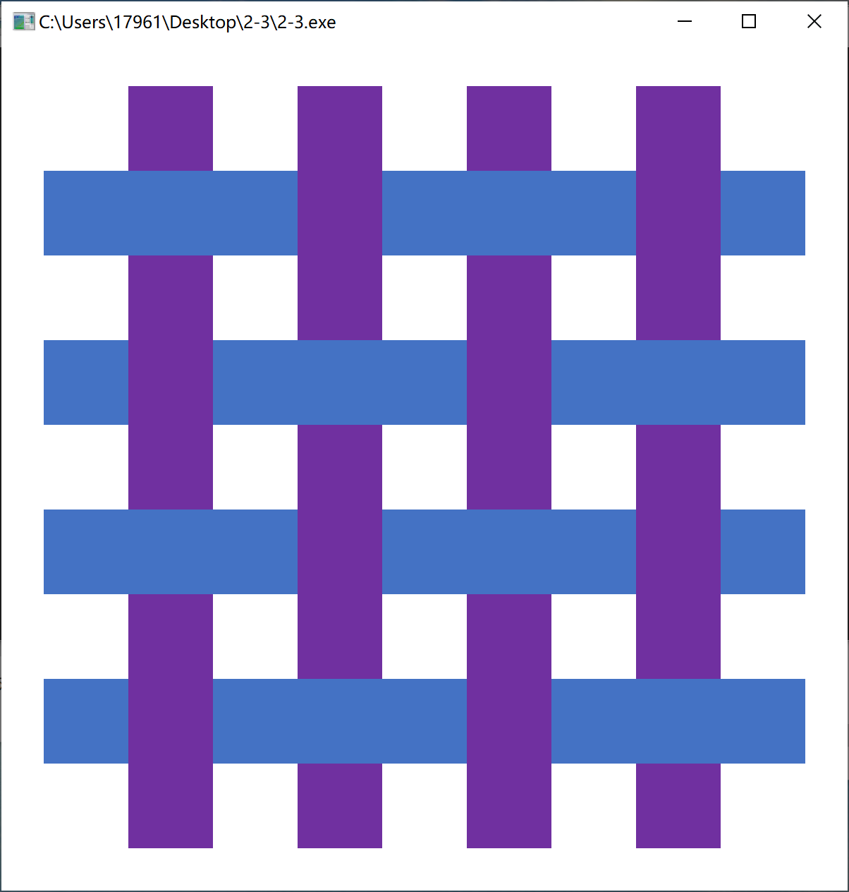

## 计算机图形学HomeWork2作业报告
> *徐珺涵 518021910531*
#### Part1
- **难点与误区：** 
  - 使用`opengl`自带的画三角形函数，导致产生错误典范，并且由于`glDrawArrays`函数的封闭性，我们无法改变其叠放关系，这也导致项目的进度一度停止。
  - 改用扫描算法时，如何判断同一水平线上哪两个点之间应该进行扫描填充
- **思路：**
&nbsp;&nbsp;&nbsp;&nbsp;建立两个类`Point`和`edge`，`Point`记录顶点的坐标和颜色，`edge`记录边由哪两个顶点构成，扫描法触发此边的最低点，以及沿着此边变化的`dx, dz, dr, dg, gb`。使用一个三维数组`image`记录渲染时的像素颜色，使用二维数组`depth`记录像素点的深度。
&nbsp;&nbsp;&nbsp;&nbsp;读入边表时，更新`Y_MAX, Y_MIN`，扫描时在最低和最高点之间进行。扫描过程中，对于属于同一三角形的的边，通过两边记录的`currentx`等数据，在两边之间按照比例计算出每个像素点的`rgb`和`depth`分别存在`image`和`depth`里。
&nbsp;&nbsp;&nbsp;&nbsp;最终使用`glDrawPixels(WIDTH, HEIGHT, GL_RGB, GL_FLOAT, image)`完成绘制。
- **效果：**
  
#### Part2
- **思路：**
&nbsp;&nbsp;&nbsp;&nbsp;绘制过程与第一题几乎一致。但是由于本题想要实现三维视图效果，因此在数据处理过程中，增加了对深度的额外判断，按照一定比例随深度增加改变该顶点对应的`x, y`坐标。
- **效果：**

#### Part3
- **思路：**
&nbsp;&nbsp;&nbsp;&nbsp;首先建立矩形类`square`，创建名字空间`condition`来鉴别矩形是竖直还是水平的。矩形类同时存储变量`turn`，判断该矩形的位置。
&nbsp;&nbsp;&nbsp;&nbsp;`depth`分段函数实现：对矩形重合区域建立如下矩阵：
$
\left[ \begin{matrix} 0 & 1 & 2 & 3 \\ 1 & 2 & 3 & 4 \\ 2 & 3 & 4 & 5 \\ 3 & 4 & 5 & 6 \end{matrix} \right]
$

&nbsp;&nbsp;&nbsp;&nbsp;&nbsp;&nbsp;&nbsp;$
\left[ \begin{matrix} 蓝 & 紫 & 蓝 & 紫 \\ 紫 & 蓝 & 紫 & 蓝 \\ 蓝 & 紫 & 蓝 & 紫 \\ 紫 & 蓝 & 紫 & 蓝 \end{matrix} \right]
$
&nbsp;&nbsp;&nbsp;&nbsp;&nbsp;&nbsp;&nbsp;&nbsp;其中第一个矩阵是个重合点根据`x, y`坐标的自然增加，每个元素等于`turn(x) + turn(y)`，是很容易得到的。而再反观颜色矩阵可以轻易得知，在数据矩阵中`mod(2)=0`的区域蓝色矩形条在上方，反之紫色在上方。根据这个信息我们在绘制矩形条时，可以根据矩形的`condition`和区域在对应的矩阵值信息直接跳过某些区域的绘制，不仅实现了编织效果，也提高了效率。
- **效果：**
